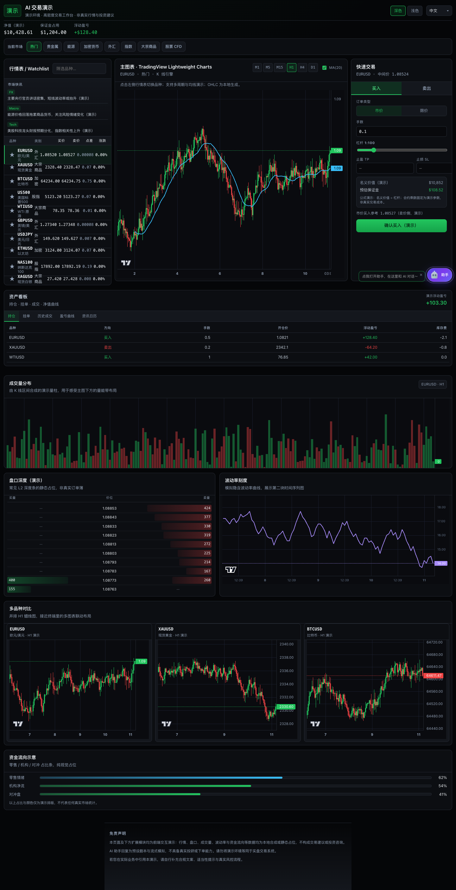

# AI Trading Demo · 高密度交易工作台

面向券商与金融科技场景的前端演示，单页整合行情、K 线、交易面板与 AI 助手，模拟交易终端的信息密度与交互路径。

## 界面预览

以下为生产构建（`npm run build && npm run preview`）下的整页截图，含主工作台、资产看板、扩展分析区（成交量柱、盘口深度、波动率、多品种对比等）与底部免责声明。

部署预览地址：
`https://josie-ljw.github.io/trading-web-UI/`

源码仓库：`github.com/Josie-ljw/trading-web-UI`

---

## 核心设计与技术点

- **多模块联动**：市场 Tab、选中品种、图表周期、均线开关、交易面板与 AI 上下文保持一致。
- **行情与渲染**：全市场定时报价更新；行情表使用虚拟列表与行级 `memo` 控制重绘。
- **图表层**：基于 `TradingView Lightweight Charts` 实现蜡烛图与 MA 叠加，并同步深浅主题；向下滚动可见成交量柱、波动率折线及多品种并排小图等常见终端模块（均为演示数据）。
- **状态协同**：自选列表通过 `localStorage` 持久化，并用 `BroadcastChannel` 做多标签同步。
- **AI 交互**：前端剧本驱动回复，使用分块输出模拟流式响应，无后端依赖。
- **部署路径**：通过 `VITE_BASE` 适配 GitHub Pages 子路径与本地根路径。

---

## 声明

本项目仅用于 UI、交互与技术演示，不构成任何投资建议；行情、持仓与 AI 输出均为模拟数据。
